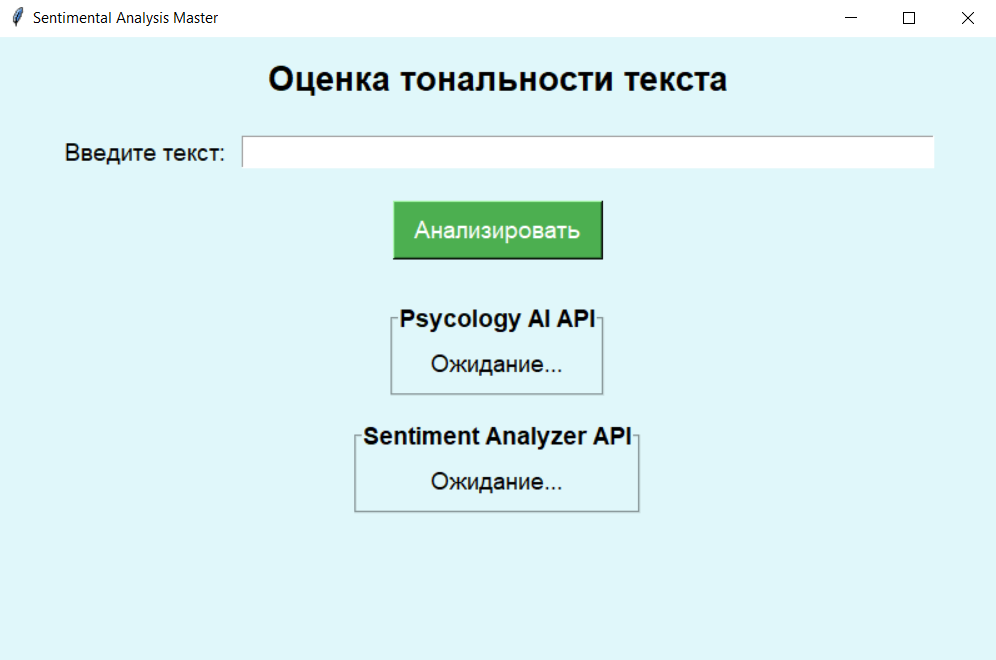
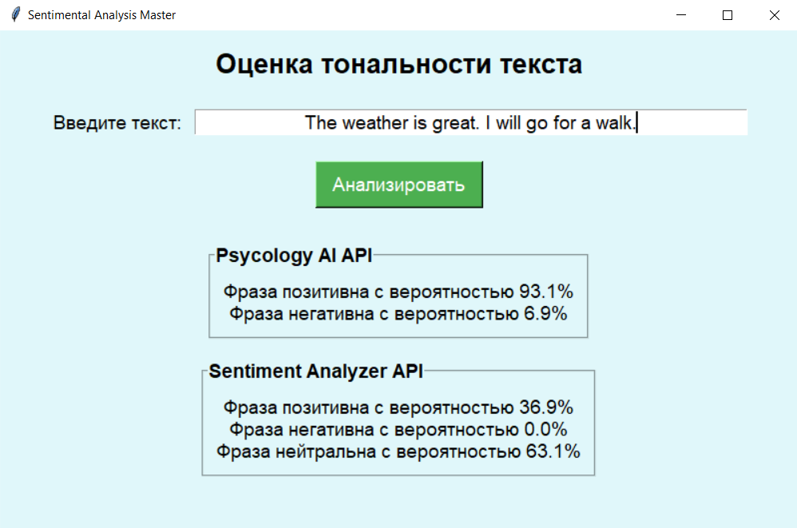

# Лабораторная работа №1

## Использование сторонних API для анализа тональности текста

### Что делаем

Использование готовых предобученных моделей является жизнеспособным решением для первичного запуска каких-либо IT-продуктов. В данной работе рассматриваются и сравниваются 2 готовых решения для оценки тональности текста.

### Зачем оценивать тональность текста

При бурном росте количества пользователей IT-продукта встает необходимость анализировать некоторые текстовые сущности, создаваемые этими самыми пользователями - отзывы, комментарии, поисковые запросы.

**Приведем в пример конкретный юзкейс:** Допустим, мы делаем соцсеть с ультра-мега цензурой всего негатива. Когда система мониторинга, сканирующая все сообщения видит, что метрика *NegativeRate* возрасла - мы включаем режим жесткого бана всех негатива. Для решения такой задачи как раз и используются модели анализа тональности текста.

### Какие API сравниваем

Обе APIшки брал с апи-маркетплейсы RapidAPI:

1) **Sentiment Analysis от компании Psycology AI** - компания Psycology AI предоставялем довольно много различных моделей анализа текста. Помимо анализа тональности, есть множество других опций - анализ эмоциональности текста, анализ продающей способности, определение психотипа автора и другие
2) **Sentiment analyzer API** - ноунейм API от одного из популярных авторов на RapidAPI.

|             | Psycology AI API       | Sentiment analyzer API       |
|--------------------|----------------|----------------|
| **Количество бесплатных запросов**          | 10к/месяц, но не более 1к/час   | 1к/месяц, но не более 1к/час   |
| **Скорость ответа**         | 1-2 секунды   | менее 0.5 секунды   |
| **Что предсказывает**         |  Позитив/Негатив и вероятность  | Позитив/Негатив/Нейтрально и вероятность   |

### Простенькое тестовое приложение

В рамках задания лабы было написано простенькое тестовое приложение, показывающее ответы обоих APIшек:

После ввода текста выводятся результаты оценки тональности:

### Валидация на датасете

Хочется проверить, насколько вообще можно доверять вышеприведенным APIшкам. Для этого был рассмотрен датасет сообщений с площадки Twitter(признано иноагентом), в которых пользователи комментировали те или иные игры. Также в данном датасете приведена ручная разметка комментариев на "Positive/Negative". Датасет был обрублен до 500 записей, т.к. лимит обоих APIшек довольно мал.

Для каждого комментария я создал бинарное поле is_positive, дабы в будущем использовать его как бинарный таргет. В качестве моделей были использованы:

1. Рандомная модель - использую случайное предсказание на отрезке [0,1] :)
2. Предсказание с помощью **Psycology AI API** - беру вероятность $Positive$ из ответа APIшки
3. Предсказание с помощью **Sentiment analyzer API** - беру вероятность $pos$ + $\frac{neu}{2}$ из ответа APIшки
   
Ниже приведена таблица с AUC метрикой для предсказанных величин по каждой из моделей:

|             | AUC score       | 
|--------------------|----------------|
| **Рандомная модель**          | 0.52   | 
| **Psycology AI API**         | 0.78  | 
| **Sentiment analyzer API**(с формулой $pos + \frac{neu}{2}$)         |  0.8  | 

Видно, что обе модели довольно неплохо разделяют негативные комментарии от позитивных. Вторая является более удобной в том смысле, что выдает в ответе не 2 класса, а 3.

### Вывод

Для создания прототипов продуктов, действительно, уместно использовать готовые модельки и доступ к ним с помощью API. В данной работе было получено, что обе проверяемых модели дают неплохое качество на валидации.